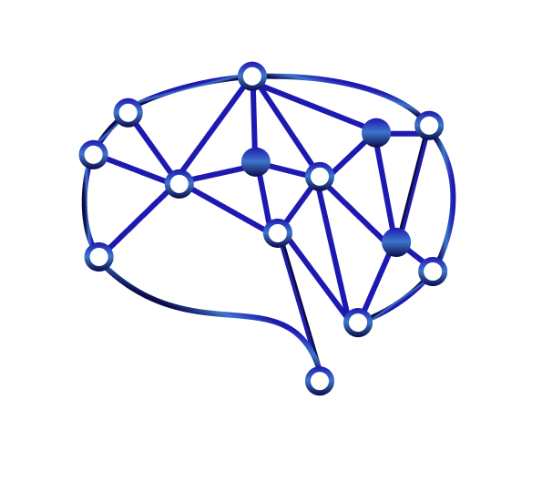

<!-- Improved compatibility of back to top link: See: https://github.com/othneildrew/Best-README-Template/pull/73 -->

<!--
*** Thanks for checking out the Best-README-Template. If you have a suggestion
*** that would make this better, please fork the repo and create a pull request
*** or simply open an issue with the tag "enhancement".
*** Don't forget to give the project a star!
*** Thanks again! Now go create something AMAZING! :D
-->

<!-- PROJECT SHIELDS -->
<!--
*** I'm using markdown "reference style" links for readability.
*** Reference links are enclosed in brackets [ ] instead of parentheses ( ).
*** See the bottom of this document for the declaration of the reference variables
*** for contributors-url, forks-url, etc. This is an optional, concise syntax you may use.
*** https://www.markdownguide.org/basic-syntax/#reference-style-links
-->
<!-- PROJECT LOGO -->
 

  

<h3 align="center">UTMIST Website</h3>

  

    Club website for the University of Toronto Machine Intelligence Student Team (UTMIST)
     
    <a href="https://github.com/UTMIST/utmist-website-2025-2026"><strong>Explore the docs »</strong></a>
     
     
    <a href="https://utmist.gitlab.io/">View Demo</a>
    &middot;
    <a href="https://github.com/UTMIST/utmist-website-2025-2026/issues/new?labels=bug&template=bug-report---.md">Report Bug</a>
    &middot;
    <a href="https://github.com/UTMIST/utmist-website-2025-2026/issues/new?labels=enhancement&template=feature-request---.md">Request Feature</a>
  

<!-- GETTING STARTED -->
## Getting Started

Please refer to [Development Environment Setup Documentation](docs/Setup.md).

<!-- CONTRIBUTING -->
## Contributing

Contributions are what make the open source community such an amazing place to learn, inspire, and create. Any contributions you make are **greatly appreciated**.

If you have a suggestion that would make this better, please fork the repo and create a pull request. You can also simply open an issue with the tag "enhancement".
Don't forget to give the project a star! Thanks again!

1. Fork the Project
2. Create your Feature Branch (`git checkout -b feature/AmazingFeature`)
3. Commit your Changes (`git commit -m 'Add some AmazingFeature'`)
4. Push to the Branch (`git push origin feature/AmazingFeature`)
5. Open a Pull Request

<!-- LICENSE -->
## License

Distributed under the project_license. See `LICENSE.txt` for more information.

<!-- CONTACT -->
## Contact

Ambrose Ling - [@GitHub](https://github.com/ambroseling) - ambrose.ling@mail.utoronto.ca

Kenny Cui - [@GitHub](https://github.com/KCui0327) - kenny.cui@mail.utoronto.ca

Project Link: [https://github.com/UTMIST/utmist-website-2025-2026](https://github.com/UTMIST/utmist-website-2025-2026)

<!-- ACKNOWLEDGMENTS -->
## Acknowledgments

* This README used a template designed by Othneil Drew, please do checkout the [repository](https://github.com/othneildrew/Best-README-Template)!
